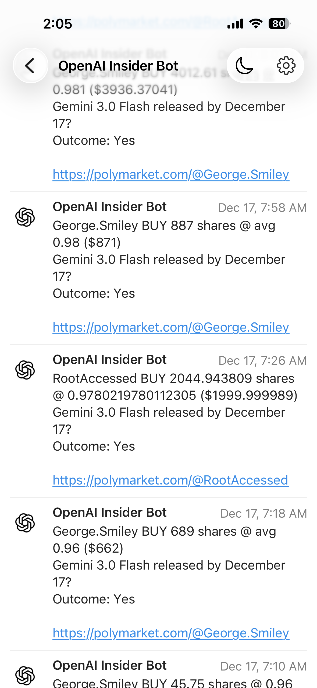
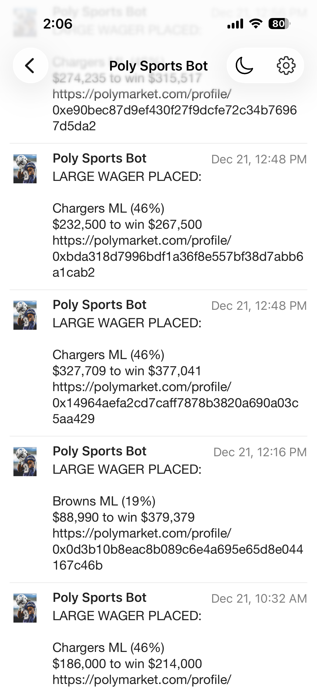
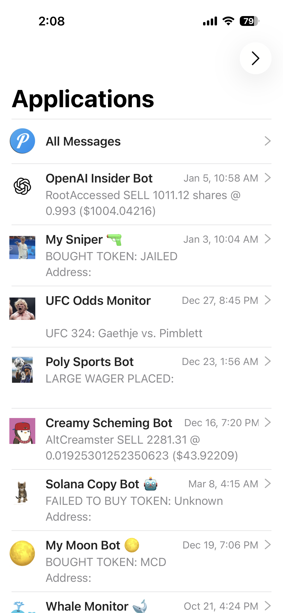

<div align="center">
<h1 style="border: none; border-bottom: none; padding-bottom: 0; margin-bottom: 20px;">POLY BOTS</h1>
</div>

A collection of utility scripts and fully functioning 'beginner' bots for Polymarket. Suitable for automation, trading, research & analytics, monitoring, arbitrage, etc.

Bots published here are not meant to get you rich directly - rather build upon this and focus on improving on the strategies to make them more advanced. These cleaned up and streamlined examples should give you a great starting point even for a beginner to understand. 

<div align="center" style="background-color: #f6f8fa; padding: 30px 10px; border-radius: 10px; margin: 30px 0; max-width: 1000px; margin-left: auto; margin-right: auto;">

<a href="images/1.png"></a>
&nbsp;&nbsp;&nbsp;&nbsp;&nbsp;&nbsp;&nbsp;&nbsp;
<a href="images/2.png"></a>
&nbsp;&nbsp;&nbsp;&nbsp;&nbsp;&nbsp;&nbsp;&nbsp;
<a href="images/3.png"></a>

</div>


## Setup

### Python & Pip

- Install **Python 3.9+**: https://www.python.org/downloads/
- Ensure **pip** is available: https://pip.pypa.io/en/stable/installation/

### Python Dependencies

Install all required packages in one step:

```bash
pip install -r requirements.txt
```

Dependencies referenced by the codebase (PyPI links):

- [`requests`](https://pypi.org/project/requests/) - HTTP calls to Polymarket & Pushover APIs
- [`pandas`](https://pypi.org/project/pandas/) - holder snapshots & CSV/analysis helpers
- [`python-dotenv`](https://pypi.org/project/python-dotenv/) - `.env` loading (sports bots)
- [`pytz`](https://pypi.org/project/pytz/) - timezone helpers
- [`polymarket-apis`](https://pypi.org/project/polymarket-apis/) - SDK helpers used in `utils/`

### Polymarket References

- Polymarket API docs: https://docs.polymarket.com/
- Data API base: https://data-api.polymarket.com

### Environment Variables

Notification bots require a `.env` file in each bot directory with your Pushover credentials (***free lightweight app designed solely for sending and receiving notifications on any kind of device or service***). Reference: [Pushover](https://pushover.net/) and their API docs https://pushover.net/api.

- **`PUSHOVER_API_TOKEN`** - Your Pushover API token (required for notification bots)
- **`PUSHOVER_GROUP_KEY`** - Your Pushover group key or user key (required for notification bots)

Example `.env`:
```
PUSHOVER_API_TOKEN=your_token_here
PUSHOVER_GROUP_KEY=your_group_key_here
```

## Utils

One-off scripts in `utils/` for various Polymarket tasks

- **`utils/poly_data_get_user_balance.py`** - Gets total holdings value across all markets for a user wallet address.
- **`utils/poly_data_get_user_activity.py`** - Fetches user activity with pagination.
	- Writes timestamped JSON under `data/user-activity/`.
- **`utils/poly_data_get_user_success_rate.py`** - Calculates profile-visible Closed-tab hit rate, API final-outcome audit, and PnL/trading result from a wallet, username, `@username`, or Polymarket profile URL.
	- Example: `python utils/poly_data_get_user_success_rate.py aussietoken`
- **`utils/poly_data_get_event_markets_and_holders.py`** - Lists markets for an event slug with top holders.
- **`utils/poly_data_get_user_positions_v1.py`** - Current positions using raw API requests.
- **`utils/poly_data_get_user_positions_v2.py`** - Current positions with P&L and risk metadata.
- **`utils/poly_gamma_list_markets.py`** - Lists markets with detailed metadata and filters.
- **`utils/poly_gamma_list_markets_by_category.py`** - Lists markets filtered by category.
- **`utils/poly_gamma_list_markets_by_volume.py`** - Lists top markets by trading volume.


## Bots (Production)

- **`my-openai-whale-bot`** - Monitors a fixed list of whale wallets and sends Pushover alerts for new trades.
	- Pulls recent activity for each wallet and filters for BUY/SELL events
	- Run via `bash my-openai-whale-bot/run.sh` with a local `.env` containing `PUSHOVER_API_TOKEN` and `PUSHOVER_GROUP_KEY`.

- **`my-sports-bot`** - NFL market and holder tracking with alerting.
	- Fetches NFL markets/games and lists top holders
	- Monitors large positions or potential profit and sends Pushover alerts for new trades
	- Cron helpers: `my-sports-bot/run_monitor_game_holders.sh` and `my-sports-bot/run_monitor_game_holders_profit.sh`.

- **`my-live-ufc-bot`** - Live UFC 99/1 moneyline odds alert bot.
	- Watches active UFC moneyline markets with Gamma event discovery, the CLOB market websocket, and the sports status websocket.
	- Sends a Pushover alert when a fighter is buyable at `0.01` or lower while that exact fight is live.
	- Run via `bash my-live-ufc-bot/run.sh` with local `.env` Pushover credentials.

- **`my-creamster-monitor-bot`** - Watches a single wallet and pings Pushover on new activity.
	- Calls the Polymarket Data API activity endpoint for the AltCreamster wallet.
	- Run via `bash my-creamster-monitor-bot/run.sh` with local `.env` credentials.

- **`my-ufc-whale-dashboard`** - UFC whale dashboard data pipeline for Streamlit.
	- Fetches live volume, BUY-side ticket counts, and top holders for active UFC markets.
	- Outputs `data/all_ufc_volumes.json`, `data/all_ufc_ticket_counts.json`, and `data/ufc_holders_*_pnl.csv`.
	- Run via `bash my-ufc-whale-dashboard/run.sh`.

## Bots (Development & Hypothetical)

- **`my-correlation-bot-v1`** - Research workspace for analyzing `@balthazarpoly` X posts/replies, media, and later Polymarket activity signals.
	- Current X export artifacts live under `my-correlation-bot-v1/data/x_balthazarpoly/`.
	- Normalize raw `bird-keychain` captures with `python my-correlation-bot-v1/scripts/normalize_x_export.py --raw-dir my-correlation-bot-v1/data/x_balthazarpoly/raw --out-dir my-correlation-bot-v1/data/x_balthazarpoly`.
	- Export public Polymarket wallet activity with `python my-correlation-bot-v1/research/poly/export_polymarket_activity.py`.

- **Market screener bot** - Discover new opportunities quickly.
	- Finds new markets by category/liquidity; scores them by volume/OI; outputs a ranked watchlist and sends alerts for new markets.
	- Uses: `Gamma` (direct REST or `PolymarketGammaClient`), maybe GraphQL.

- **Directional trading bot** - Model-driven entries and exits.
	- Compute fair value and place trades when mispricings appear.
	- Enforce position sizing, stop-loss, and exposure limits.
	- Uses: `PolymarketGammaClient` + `PolymarketClobClient` (+ WebSockets for fills).

- **Market-making / liquidity provision** - Quote both sides and earn spread.
	- Streams orderbook updates, keeps quotes around mid, manages inventory, and cancels/replaces orders on fills to provide consistent liquidity and earn the spread.
	- Uses: `PolymarketGammaClient` + `PolymarketClobClient` + `PolymarketWebsocketsClient`.

- **PnL / risk monitor** - Portfolio health and risk alerts.
	- Periodically pulls positions & PnL, applies risk limits, possibly triggers hedges when thresholds are breached.
	- Uses: `PolymarketDataClient` + GraphQL subgraphs.

- **Copy-trading bot** - Mirror top wallets with controls.
	- Track selected wallets and mirror trades with caps and delays.
	- Add safety checks for slippage, liquidity, and market limits.
	- Uses: `PolymarketDataClient` for leaderboards/holders, `PolymarketClobClient` for mirroring trades.
