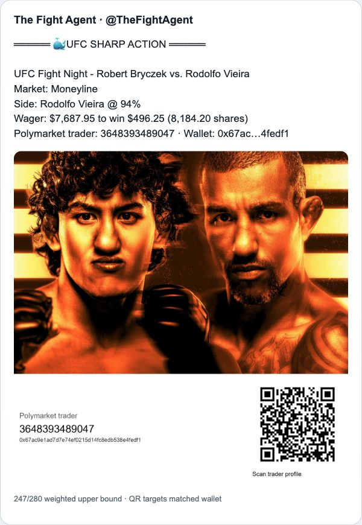
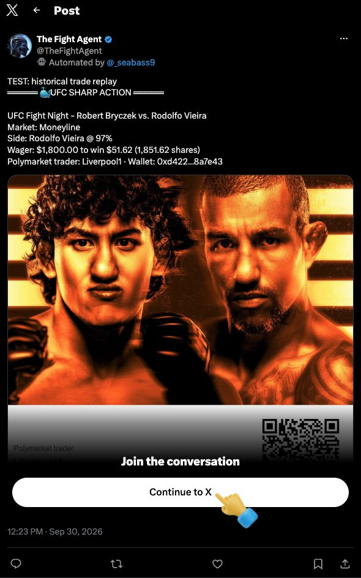

# UFC trader attribution verification — 2026-09-30

## Result

17 focused regression tests pass. Two attributed samples for different wallets
and one ambiguity fallback were generated. Native QR decoding passed for both
2000-pixel JPEGs and both 560-pixel JPEG quality-75 mobile copies. The QR in
X's actual served, recompressed 1200×1193 WebP also decodes correctly.

Exactly one authorized historical test was published through the production
`upload_x_image` / `send_x_tweet` functions, to OAuth-confirmed `@TheFightAgent`:
[live test](https://x.com/TheFightAgent/status/2105332631097241711).
Production monitoring and deployment were not changed or started.

## Source evidence and limitations

`sample-1-fixture.json` and `sample-2-fixture.json` contain genuine public
Data API trades from the September 26 UFC Bryczek/Vieira market. Their stream
events are **reconstructed from those trades**, not recorded WebSocket messages.
This verifies matching against real public rows, not live stream-to-index latency.
Both fixtures were also replayed through real read-only `lookup_trader` calls:
each matched one candidate on the first attempt, with agreeing transaction hash.

| Sample | Wallet | Match | Weighted text upper bound |
| --- | --- | --- | --- |
| Liverpool1 | `0xd4225ee3c77fda4d1360e096669e4e97198a7e43` | transaction hash, one candidate | 243 |
| 3648393489047 | `0x67ac9e1ad7d7e74ef0215d14fc8edb538e4fedf1` | transaction hash, one candidate | 247 |
| Ambiguity fallback | real row plus deliberately conflicting synthetic wallet | two candidates, attribution omitted | 188 |
| Live historical test | Liverpool1 wallet above | sample 1 with explicit TEST prefix | 273 |

The fallback's conflicting wallet is synthetic and must not be interpreted as
a genuine second trader. Unit tests use entirely synthetic identifiers.
The existing cached card art is retained in `source-artwork.jpg` for repeatable
offline renders. No account credentials or private environment files are included.

## QR destinations

- `sample-1.jpg`, `sample-1-mobile.jpg`, and `x-served-medium.webp`:
  `https://polymarket.com/profile/0xd4225ee3c77fda4d1360e096669e4e97198a7e43`
- `sample-2.jpg` and `sample-2-mobile.jpg`:
  `https://polymarket.com/profile/0x67ac9e1ad7d7e74ef0215d14fc8edb538e4fedf1`

The public profile pages show Liverpool1 and 3648393489047 respectively.
The first wallet route redirects to `/@liverpool1` in Chrome. QR destinations
use the wallet route rather than mutable names. Every decode returned exactly
one QR payload. The decoder is `decode_qr.swift`, using Apple's native Vision
framework; it adds no project dependency.

## Focused checks

Passed: unique and hashless-unique matching; duplicate response deduplication;
ambiguity rejection; transaction-hash disagreement; split-size/wrong-token,
side, price, condition and timestamp rejection; malformed/incomplete responses;
invalid wallets; missing and URL-like names; delayed indexing retries; hard
caller timeout; source-version/wallet-specific image caching; image failure;
long Unicode text while preserving wager amounts and wallet; Gamma condition
metadata; offline dry-run with all network calls forbidden; unchanged Pushover
behavior; and no automatic retry after uncertain X posting.

The actual CLI was run on portable fixtures, not only the helper function.
`git diff --check` passes. Tests and CLI replay also pass in a fully isolated
temporary venv using qrcode 8.2 and Pillow 12.3.0. Initial rendering used Pillow
12.2.0; both versions were verified.

```bash
python -m unittest discover -s my-sports-bot-ufc -p test_trader_attribution.py -v
python my-sports-bot-ufc/monitor_ufc_large_wagers.py --dry-run \
  --trade-fixture my-sports-bot-ufc/verification/sample-1-fixture.json \
  --output-dir /tmp/ufc-sample-1
python my-sports-bot-ufc/monitor_ufc_large_wagers.py --dry-run \
  --trade-fixture my-sports-bot-ufc/verification/sample-2-fixture.json \
  --output-dir /tmp/ufc-sample-2
python my-sports-bot-ufc/monitor_ufc_large_wagers.py --dry-run \
  --trade-fixture my-sports-bot-ufc/verification/fallback-fixture.json \
  --output-dir /tmp/ufc-fallback
swift my-sports-bot-ufc/verification/decode_qr.swift \
  my-sports-bot-ufc/verification/sample-1.jpg \
  my-sports-bot-ufc/verification/sample-1-mobile.jpg \
  my-sports-bot-ufc/verification/sample-2.jpg \
  my-sports-bot-ufc/verification/sample-2-mobile.jpg \
  my-sports-bot-ufc/verification/x-served-medium.webp
```

## Live readback and billing

OAuth `/2/users/me` confirmed author ID `1879013507955298304` / TheFightAgent.
The media upload returned `2105332628521934849`; the single POST returned
`2105332631097241711`. Official API readback returned HTTP 200 with the same
author, text, and one attached photo. Browser-visible text agrees.
`live-readback.json` preserves that response.

Submitted text has no external URLs or X mentions. X adds a normal attached-photo
`t.co` entity on readback; its expanded destination is the post's own `/photo/1`,
not a Polymarket URL. The actual browser-observed image URL was downloaded:
`https://pbs.twimg.com/media/HTek3wEW4AEtCLs?format=webp&name=medium`.
Native Vision decoded it to the exact Liverpool1 wallet profile.

Bird readback was attempted once using the TheFightAgent Chrome profile, but
could not run because that profile has no `auth_token` / `ct0` cookies. The
official API and public browser readback supplied the verification instead.
The focused live-post screenshot contains X's logged-out overlay; it is not a
signed-in-account screenshot. Sample screenshots have no such overlay.

**Actual charge: unverified.** No configured billing bearer token was available,
and the developer console redirected to login. X documents $0.015 ordinary
posts versus $0.20 URL posts, but does not explicitly guarantee QR-in-image
classification. Neither a working QR nor a URL-free submitted payload proves
the final billed tier. Verify the ledger before deployment.

## Official references

- [Public trades endpoint](https://docs.polymarket.com/api-reference/core/get-trades-for-a-user-or-markets)
- [Raw WebSocket last_trade_price fields](https://docs.polymarket.com/market-data/realtime-data)
- [Public wallet profile](https://docs.polymarket.com/api-reference/profiles/get-public-profile-by-wallet-address)
- [qrcode and Pillow](https://github.com/lincolnloop/python-qrcode)
- [X weighted character rules](https://docs.x.com/fundamentals/counting-characters)
- [X media upload](https://docs.x.com/x-api/media/upload-media)
- [X create post](https://docs.x.com/x-api/posts/create-or-edit-post)
- [X pricing](https://docs.x.com/x-api/getting-started/pricing)
- [X usage credits](https://docs.x.com/x-api/usage/get-usage-credits)

## Sample previews




