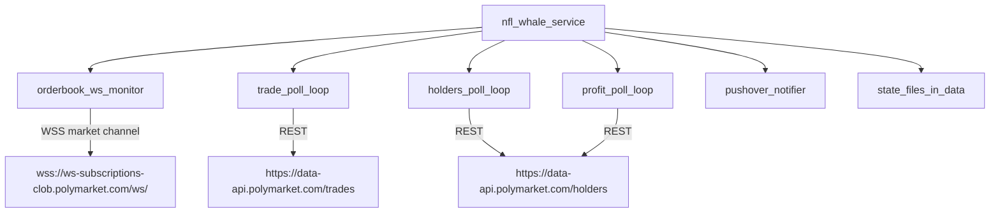

```markdown
# Unified NFL whale monitor service (Polymarket APIs)

## Goal

Run **one always-on service** (systemd) that covers:

- **Real-time pending orders** via **CLOB WebSocket market channel**
- **Executed fills/trades** via **Data API polling**
- **Holder/position snapshots + profit snapshots** via **Data API polling**

This keeps ops consistent (one process to start/stop/restart), even though not all data sources are push-based.

## Why not “all realtime” purely via Polymarket WebSocket

Polymarket’s public WebSocket is for **CLOB market data** (orderbook + price updates). The official docs list the WebSocket base and the REST bases for Gamma/Data/CLOB here: [Polymarket endpoints](https://docs.polymarket.com/quickstart/reference/endpoints).

- **Orderbook realtime**: yes (CLOB WebSocket)
- **Trades + holders realtime**: not via that same public WebSocket; those are exposed via **Data API REST** (so polling remains necessary)

## Proposed architecture

We’ll add a single new “supervisor” script that runs all monitors together:



## Implementation plan

### 1) Create a single unified runner

- Add `[nfl_whale_service.py](nfl_whale_service.py)` that:
  - Loads `.env` once (Pushover creds, thresholds, intervals)
  - Starts the **WebSocket orderbook monitor** by reusing logic from `[monitor_pending_orders.py](monitor_pending_orders.py)`
  - Runs **polling loops** on intervals (in threads) for:
    - Trades (reuse `[get_nfl_game_bets.py](get_nfl_game_bets.py)` logic)
    - Holder snapshots (reuse `[monitor_game_holders.py](monitor_game_holders.py)` logic)
    - Profit snapshots (reuse `[monitor_game_holders_profit.py](monitor_game_holders_profit.py)` logic)
  - Ensures polling jobs **don’t overlap** (single shared lock), so you don’t accidentally DOS yourself.
  - Handles 429/timeouts with **exponential backoff** and logs retries.

### 2) Standardize config + notifications

- Update `[get_nfl_game_bets.py](get_nfl_game_bets.py)` to match the newer pattern used by `[monitor_pending_orders.py](monitor_pending_orders.py)`:
  - Pushover creds read from env (`PUSHOVER_API_TOKEN`, `PUSHOVER_GROUP_KEY`)
  - Thresholds read from env (with sane defaults)
- Keep the existing output/state files so nothing breaks:
  - `data/last_fill_state.json`
  - `data/nfl_holders_snapshot.csv`
  - `data/nfl_holders_profit_snapshot.csv`
  - `data/pending_orders_state.json`

### 3) Add a systemd unit (one service to run)

- Add `[deploy/polymarket-nfl-whale.service](deploy/polymarket-nfl-whale.service)` (repo template) with:
  - `WorkingDirectory=/home/trinity/polymarket-bots/my-sports-bot`
  - `ExecStart=/home/trinity/.pyenv/shims/python nfl_whale_service.py`
  - `Restart=always`
  - stdout/stderr to a single log file

### 4) Simplify cron

- Keep cron only for **data refresh**:
  - `get_nfl_games.py` weekly (or change to daily if you want fresher token lists)
- Remove the other cron entries once the service is stable.

### 5) Update docs

- Update `[README.md](README.md)` with:
  - New recommended “single service” setup
  - What each internal loop does and default intervals
  - How to install/enable the systemd unit

## Success criteria

- One `systemctl status polymarket-nfl-whale` shows the whole system is running.
- You still receive:
  - Pending order alerts (WS)
  - Trade/fill alerts (poll)
  - Holder + profit alerts (poll)
- No overlapping runs; no runaway request volume.

## Notes on official endpoints

We will keep all network calls aligned to the official base URLs documented by Polymarket: [Polymarket endpoints](https://docs.polymarket.com/quickstart/reference/endpoints).

```

```

